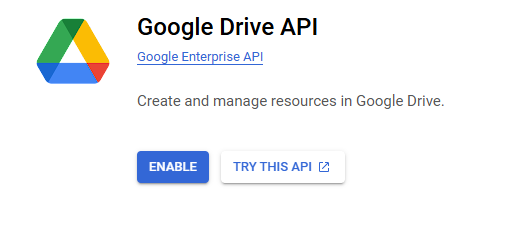
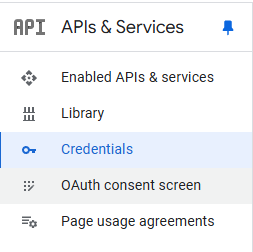
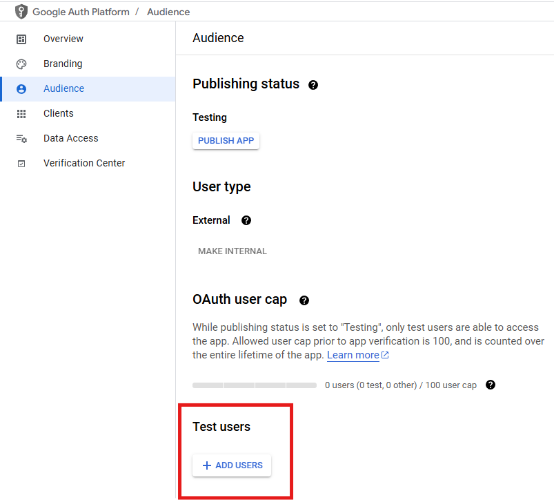

**Quick reference: [Installation](#installation) &rarr; [API Set Up](#online-api-set-up) &rarr; [Operation](#operation)**

# Installation
- Get Python from [Python.org](https://www.python.org/)
- The project folder `fireRunSeverity` is assumed to be placed under %userprofile%
  - i.e. C:\Users\user\fireRunSeverity

- Click the batch file `Initialization.bat` on Windows system.
  - a virtual environment will be established under `%userprofile%/mapGee` (i.e. `Users/user/mapGee`)
  - a `poetry` Python virtual environment will be established under project folder `fireRunSeverity/Python/.venv`

- For removing the virtual environment, simply remove the folder mentioned:
  - `%userprofile%/mapGee`
  - `fireRunSeverity/Python/.venv`

## Direct install packages
- `python -m pip install [dependencies]`
- Refer to [`pyproject.toml`](./pyproject.toml)
- Install dependencies listed in `tool.poetry.dependencies`
- Package needed for current project: \
   `earthengine-api`, `geemap`, `geopandas`, `google-auth-oauthlib`, `timezonefinder`, `pytz`, `setuptools = "75.3.0"`


# Online API set up
**Note**: You will need to consent the use of data for your own account everytime the program access the online resources. Just keep approve the usage as long as the program is running on your own computer.

## GEE project setup
**Necessary for `severityCalc`**(.py/.ipynb)

You will need to setup GEE project in your Google account to continue with Python API.
- Sign up for [Google Earth Engine](https://code.earthengine.google.com/register)
  - unpaid -> Academia & Research
  - Create a new Google Cloud Project
    - **ID: will be the project ID used in Python code**
  - Confirm -> You will see the code panel show up
- Python Authorization
  - Back to [Google Cloud Console](https://console.cloud.google.com/)
  - Search for `Google Earth Engine API` in the search bar
  
  - Enable the API in the intro page
  

## Google Drive API setup
**Necessary for `driveDownload`**(.py/.ipynb)

Check the [Google document](https://developers.google.com/drive/activity/v2/quickstart/python) for detailed instructions.
- Enable Google drive API as enabling Google Earth Engine API in [GEE setup](#gee-project-setup)

- Go to [Credentials](https://console.cloud.google.com/apis/credentials) in your APIs & Services.
  1. CREATE CREDENTIALS
  2. OAuth client ID
  3. Application Type &rarr; Desktop app
  4. Give the Name
  5. CREATE
  6. Click **DOWNLOAD JSON**
  7. Save file as `.credential.json` under folder `fireRunSeverity/Python/geeFetch`
- Add test user into the APP
  1. On the same page as [Credentials](https://console.cloud.google.com/apis/credentials), click **OAuth consent screen** on the left navigation column
  
  2. Click **Audience** on the left menu
  3. Click **ADD USERS** in the lower part of the main content
  
  4. type in the google account same as you used for APIs

# Operation

- Make sure the fire perimeter data (.shp) is located in `fireRunSeverity/data/fireruns/(aoi_name)/input` for the algorithm to get the input data

- Go to folder [geeFetch](geeFetch), find the batch file (`.bat`) to run the program automatically on Windows system.
  - `Run_severityCalc.bat` for calculating maps using GEE server
  - `Run_driveDownload.bat` for obtaining maps from Google drive

---

- For testing the process, one can just operate algorithms on Jupyter notebooks located in the [notebook folder](/geeFetch/notebook/), where the code was mainly tested and then integrated into `geeFetch/main.py`.

The `force` option was set as `True` in `ee.Authenticate` to ensure reproducibility. You can change the option to `False` so that login won't be necessary every time on the same computer.

## Login process in `ee.Authenticate()`
After `ee.Authenticate()` is activated, login website will prompt up for google account login. Use the account that has [GEE project setup](#gee-project-setup). Follow the instruction to grant all access for the app (i.e. Python API), and paste the generated token back to the command promt or Jupyter notebook being operated.

If the program stopped at `ee.Initialize()`, specify the **project ID (e.g. "project-id")** set up in [Gee Project Setup](#gee-project-setup) as follow:
`ee.Initialize(project = "project-id")`

---

# Project management through `Poetry` (Optional)
**Note**:The process had been integrated into `Initialization.bat`, you can check the whole process in the batch file. (only works for Windows)

### Install `Poetry` for package management
- Adopted from [poetry website](https://python-poetry.org/docs/#installing-manually)
- Type in command line (replace `%VENV_PATH%` with any path for any prefered place)
```{python}
set VENV_PATH=%userprofile%/mapGee
python -m venv %VENV_PATH%
%VENV_PATH%/bin/pip install -U pip setuptools
%VENV_PATH%/bin/pip install poetry
```

### Install packages for GEE and Drive API
- switch to Python folder in this project: `fireRunSeverity/Python`
- intall using `pyproject.toml` file provided (automatically done by poetry) 
```
set PATH=%VENV_PATH%/Scripts/;%PATH%
cd %userprofile%/fireRunSeverity/Python
poetry install
```

## Everytime setup (For `Poetry`)
(**For `Poetry` package management**) Always select the Python under the virtual environment (`%VENV_PATH%`) you set up [here](#install-poetry-for-package-management) as the default Python engine no matter you are using Jupyter notebook or command prompt.

- Add virtual env of poetry to PATH temporarily
  - `set PATH=%userprofile%/mapGee/Scripts/;%PATH%`

```
set VENV_PATH=%userprofile%/mapGee
set PATH=%VENV_PATH%/Scripts/;%PATH%
cd %userprofile%/fireRunSeverity/Python
poetry run python main.py
```