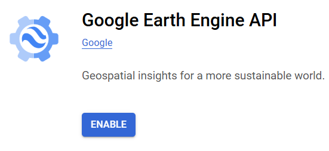

# Installation
- Get Python from [Python.org](https://www.python.org/)
- The project folder `fireRunSeverity` is assumed to be placed under %userprofile%
  - i.e. C:\Users\user\fireRunSeverity

## Install Poetry for package management
- Adopted from [poetry website](https://python-poetry.org/docs/#installing-manually)
- Type in command line (replace `%VENV_PATH%` with any path for any prefered place)
```{python}
set VENV_PATH=%userprofile%/mapGee
python -m venv %VENV_PATH%
%VENV_PATH%/bin/pip install -U pip setuptools
%VENV_PATH%/bin/pip install poetry
```

## Install packages for GEE
- switch to Python folder in this project: `fireRunSeverity/Python`
- intall using `pyproject.toml` file provided (automatically done by poetry) 
```
set PATH=%VENV_PATH%/Scripts/;%PATH%
cd %userprofile%/fireRunSeverity/Python
poetry install
```

# GEE project setup
You will need to setup GEE project in your Google account to continue with Python API.
- Sign up for [Google Earth Engine](https://code.earthengine.google.com/register)
  - unpaid -> Academia & Research
  - Create a new Google Cloud Project
    - **ID: will be the project ID used in Python code**
  - Confirm -> You will see the code panel show up
- Python Authorization
  - Back to [Google Cloud Console](https://console.cloud.google.com/)
  - Search for `Google Earth Engine API` in the search bar
  
  - Enable the API in the intro page
  

# Operation
For simple usage, one can just operate algorithms on Jupyter notebooks located in the [notebook folder](/geeFetch/notebook/), where the code was mainly tested and will be later integrated into `geeFetch/main.py`.

Always select the Python under the virtual environment (`%VENV_PATH%`) you set up [here](#install-poetry-for-package-management) as the default Python engine no matter you are using Jupyter notebook or command prompt.

The `force` option was set as `True` in `ee.Authenticate` to ensure reproducibility. You can change the option to `False` so that login won't be necessary every time on the same computer.

## Login process in `ee.Authenticate()`
After `ee.Authenticate()` is activated, login website will prompt up for google account login. Use the account that has [GEE project setup](#gee-project-setup). Follow the instruction to grant all access for the app (i.e. Python API), and paste the generated token back to the command promt or Jupyter notebook being operated.

## Everytime setup
- Add virtual env of poetry to PATH temporarily
  - `set PATH=%userprofile%/mapGee/Scripts/;%PATH%`

```
set VENV_PATH=%userprofile%/mapGee
set PATH=%VENV_PATH%/Scripts/;%PATH%
cd %userprofile%/fireRunSeverity/Python
poetry run python main.py
```