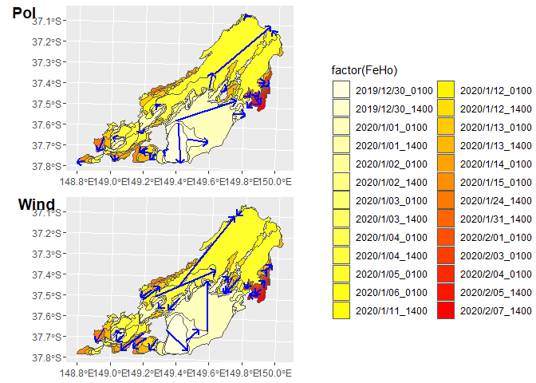
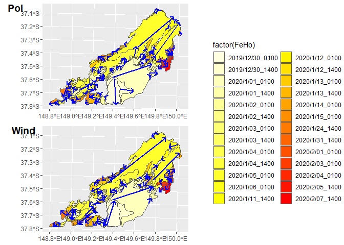

<!-- README.md is generated from README.Rmd. Please edit that file -->

# FireRuns post fire analysis project

<!-- badges: start -->
<!-- badges: end -->

This project aims to analyse the post fire effects and relate the
influence of fire run speed to environmental change.

### Package Requirement

**R Environment**:`FireRuns`, `ecmwfr`

**Python Environment**: `earthengine-api`, `geemap`

## Workflow

.

------------------------------------------------------------------------

## Installation

You can install the development version of FireRuns like so:

``` r
# devtools::install_github("AndreaDuane/FireRuns")
```

## Example

`area_process()` will look into the data folder named with `"GIF14_Au"`
to process the fire run calculation. The results are like the following:

``` r
area_process("GIF14_Au")
```



`area_process_allArrow()` outputs max runs in all polygons. The
`areaList` helps run algorithm in a row with preset parameters.

``` r
areaList = list(c(aoi = "GIF14_Au",   nameID = "OBJECTID",   nameFeho_i = "FeHo"),
                c(aoi = "LaJonquera", nameID = "ObjectIDgo", nameFeho_i = "FeHo"),
                c(aoi = "LC1",        nameID = "ObjectID",   nameFeho_i = "FeHo"),
                c(aoi = "StLlorenc",  nameID = "OBJECTID",   nameFeho_i = "FeHo_2")
)
aa = areaList[[1]]
area_process_allArrow(aa[['aoi']],  aa[['nameID']], aa[['nameFeho_i']])
```


